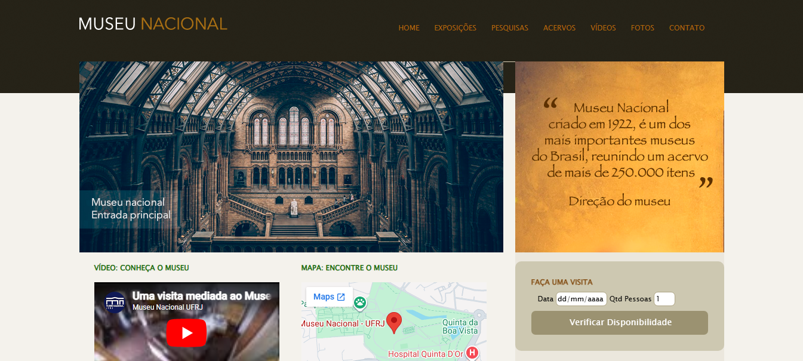

<h2 id="sobre-o-projeto">1. 🏛️ Museu Nacional: Portal de Preservação Histórica 🏛️</h2>

Bem-vindo ao projeto **Museu Nacional**! Este repositório apresenta um portal institucional dedicado à história e cultura brasileira. O site foi projetado para ser um centro de informações completo, oferecendo detalhes sobre exposições icônicas, acervos científicos, além de ferramentas interativas como mapas de localização, vídeos institucionais e um sistema de verificação de disponibilidade para visitas.

---

## 📚 Tabela de Conteúdo

| 🏛️ O Projeto | 🛠️ Técnico | 🤝 Comunidade |
| :---: | :---: | :---: |
|  |  |  |
|  |  |  |
|  |  |  |
|  |  |  |

---

<h2 id="tecnologias-utilizadas">2. ⚙️ Tecnologias Utilizadas</h2>

| Camada | Tecnologias | Descrição |
| :--- | :--- | :--- |
| **Estrutura** |  | Tags semânticas como `nav`, `section`, `article` e `aside`. |
| **Estilo Base** |  | Garantia de renderização consistente em múltiplos navegadores. |
| **Design** |  | Layout de portal com barra lateral e seções de mídia. |
| **Multimídia** |  | Integração de vídeos externos e mapas dinâmicos. |

---

<h2 id="como-acessar">3. 🚀 Como Acessar</h2>

Explore o acervo digital e a história de 200 anos do Museu clicando abaixo:

  

---

<h2 id="funcionalidades">4. 🧩 Funcionalidades Principais</h2>

O portal foi desenvolvido para ser uma central de serviços ao visitante:

| Funcionalidade | Descrição |
| :--- | :--- |
| 📹 **Player de Vídeo** | Conheça o museu através de tours virtuais integrados do YouTube. |
| 📅 **Agendamento Prévio** | Formulário funcional para verificar disponibilidade de datas e vagas. |
| 🖼️ **Galeria Fotográfica** | Exibição visual de itens do acervo e instalações físicas. |
| 🦖 **Catálogo de Exposições** | Listagem detalhada de temas como Paleoarte e Arqueologia. |
| 🗺️ **Mapa Interativo** | Localização geográfica facilitada através de embed do Google Maps. |

---

<h2 id="destaques-tecnicos">5. 💻 Destaques Técnicos</h2>

O projeto destaca-se pela organização robusta de áreas de informação:

### 📐 Gestão de Sidebar (`aside`)
Uso estratégico da coluna lateral para elementos de utilidade (agendamento) e engajamento visual (galeria), mantendo o fluxo de leitura do conteúdo histórico desimpedido na coluna principal.

### 🔄 Retrocompatibilidade
Implementação do `html5shiv` via comentário condicional para assegurar que navegadores legados (como IE9) consigam interpretar corretamente as novas tags semânticas do HTML5.

---

<h2 id="codigo-fonte">6. 📂 Repositório</h2>

Confira a estrutura de pastas e a organização dos assets:

---

<h2 id="como-contribuir">7. 🤝 Como Contribuir</h2>

Siga os passos abaixo para fortalecer este projeto:

| Fase | Ação | Link / Comando |
| :---: | :--- | :--- |
| **01** | **Fork** |  |
| **02** | **Branch** | `git checkout -b feature/NovaGaleria` |
| **03** | **Commit** | `git commit -m 'feat: novas fotos da exposição de dinossauros'` |
| **04** | **Push** | `git push origin feature/NovaGaleria` |
| **05** | **PR** |  |

---

<h2 id="faq">8. 🧠 Perguntas Frequentes</h2>

<strong>Por que usar o normalize.css ❓</strong>

🛠️ <strong>Resposta:</strong> Cada navegador aplica estilos padrão diferentes. O <code>normalize.css</code> reseta esses estilos para uma base comum, garantindo que o site tenha a mesma aparência no Chrome, Firefox ou Safari.

<strong>Como o formulário de visita funciona ❓</strong>

📩 <strong>Resposta:</strong> Atualmente a interface captura os dados. Em uma aplicação de produção, esses dados seriam enviados a um backend para consulta no banco de dados de vagas do museu.

<strong>O site suporta acessibilidade ❓</strong>

♿ <strong>Resposta:</strong> Sim. O uso de tags semânticas e o atributo <code>alt</code> nas imagens facilitam a leitura por softwares de auxílio a pessoas com deficiência visual.

---

<h2 id="codigo-fonte">9. 💻 Código Fonte</h2>

Explore a arquitetura CSS e o arquivo Normalize:

---

<h2 id="créditos">10. 📝 Créditos & Reconhecimentos</h2>

O projeto do Museu Nacional celebra a educação e a memória brasileira:

| Atribuição | Responsável / Recurso | Descrição |
| :--- | :--- | :--- |
| **Dev & Arquitetura** | **DomisDev** | Desenvolvimento front-end e curadoria de conteúdo informativo. |
| **Acervo Histórico** | **Museu Nacional/UFRJ** | Fonte de dados sobre os 200 anos de história e exposições. |
| **Mídia & Vídeo** | **YouTube** | Provedor de conteúdo audiovisual para o tour virtual. |
| **Apoio Técnico** | **Google Gemini** | Padronização e estruturação documental para o padrão King-Domfy. |

### 🎯 Missão do Projeto
> "Transformar o acesso à cultura em uma experiência digital fluida, preservando a memória do Museu Nacional e facilitando o planejamento de visitas para as novas gerações."

---

<h2 id="licenca">11. 📄 Licença</h2>

Este projeto está licenciado sob a 

---

<h2 id="perfil-do-github">12. 👨‍💻 Perfil do GitHub</h2>

